<h1 align="center">Museume Data Analysis With SQL</h1>

➣ Description:
This SQL project is designed to analyze data related to museums, artists, and artworks. The dataset used for this project was sourced from Kaggle three main tables: artist, work, and museum.

➣ Project Structure : 
1)Database Schema: The project begins with the creation of a suitable database schema to organize the data effectively. Three tables are created: artist, work, and museum, each with appropriate fields to store information about artists, their works, and the museums where the works are displayed.

2)Data Population: After defining the schema, the tables are populated with data extracted from the Kaggle dataset. This step ensures that the database contains relevant information for subsequent analysis.

3)Query Analysis: A series of SQL queries are executed to extract meaningful insights from the dataset. These queries cover a variety of analytical tasks,  
including: 
• Retrieving the full names of artists along with the names of the museums where their works are displayed. 
• How many works does each artist have in the database? Display the artist's full name along with the count of their works, ordered by the count in descending order. 
• List the top 5 museums with the highest number of works displayed in the database, along with their respective counts. 
• Display the names and styles of the works along with the corresponding museum names, ordered by the museum name in ascending order. Limit the results to 10. 
• Show the total sale price for each artist's works. Display the artist's full name along with the total sale price, ordered by the total sale price in descending order. 
• List artists who have more than 3 works in the database, along with the count of their works. 
• Retrieving works and their corresponding artists' full names for works with a sale price smaller than their regular price. 
• Calculating the average height and width of the artworks in the database. 
• Finding the maximum sale price among all works in each museum. 
• Concatenating the full name, and nationality of artists along with the count of their works, ordered by the count.

➣ Data Sources: from Kaggle.

➣ Usage:   
You can use this project as a reference for SQL-based analysis of museum-related datasets. The provided queries can be modified or extended to suit specific analytical requirements. By exploring the SQL queries and their results, you can gain insights into various aspects of the museum domain, including artist contributions, artwork popularity, museum performance, and more.

Feel free to fork this repository, adapt it to your own datasets, or contribute additional queries to further enhance its analytical capabilities.   

## Setup

1. Create a MySQL database named `project_2`.

2. Create a table named `Olympics` to store the dataset.
   

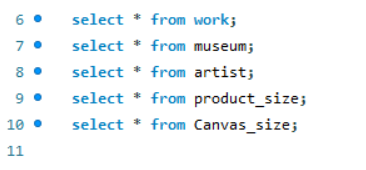

3. Load Data from CSV file

## Queries and Analysis

1. **Show how many medal counts present for entire data.**

   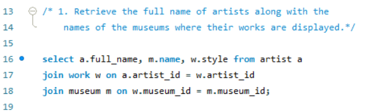
   
   Result⬇️

   

2. **Show count of unique sports present in Olympics.**

   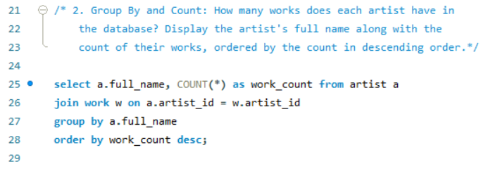
   
   Result⬇️

   
   
3. **Show how many different medals won by team India.**

   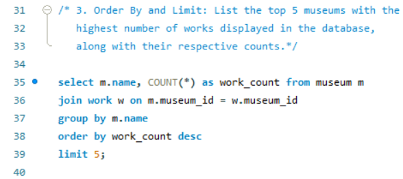
   
   Result⬇️

   

4.**Show event wise medals won by India show from highest to lowest medals won in order.**

   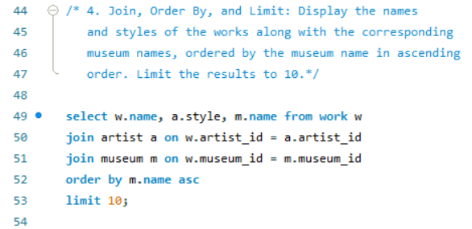
   
   Result⬇️

   

5.**Show event wise medals won by India in order of year**
 
   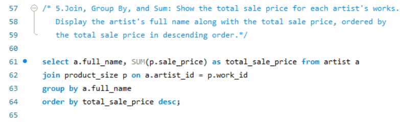
   
   Result⬇️

   
   
6.**Show country who won maximum medals.**
 
   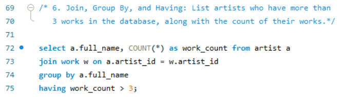
    
   Result⬇️

   

7.**show top 10 countries who won gold**

   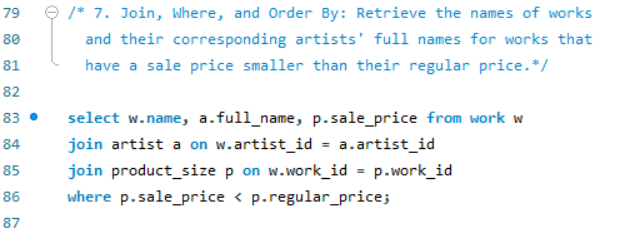
   
   Result⬇️

   

8.**show in which year did United states won most gold medal**

   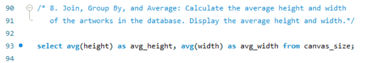
   
   Result⬇️

   

9.**In Witch sports United States has most medals.**

   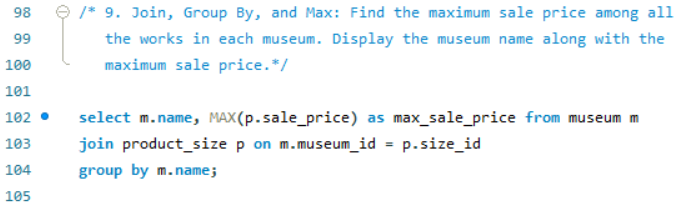
   
   Result⬇️

   

10.**Find top three players who won most medals along with their sports and country**

   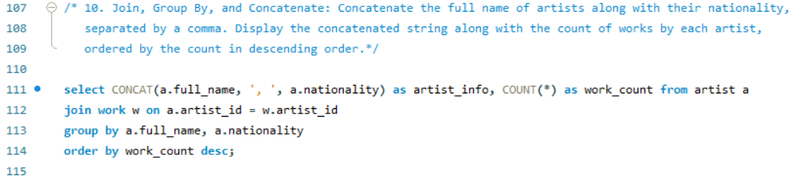
   
   Result⬇️

   
